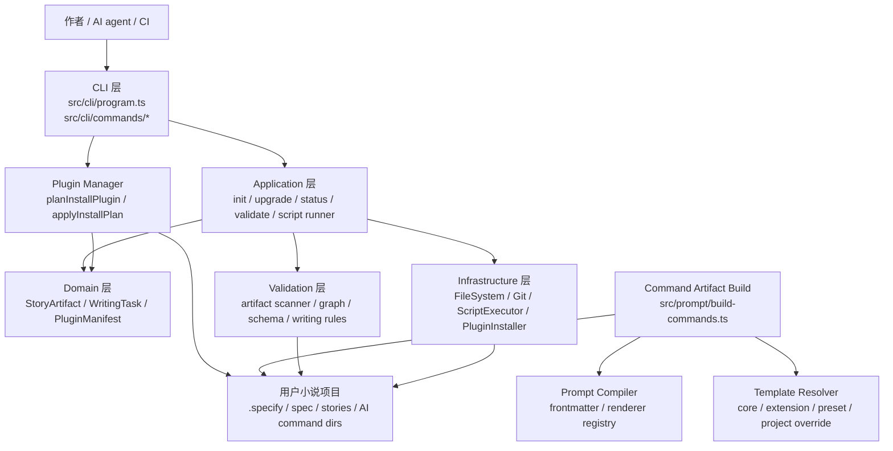
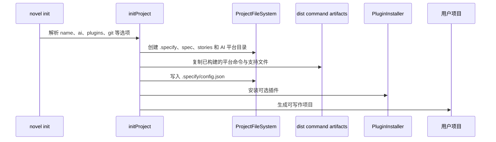
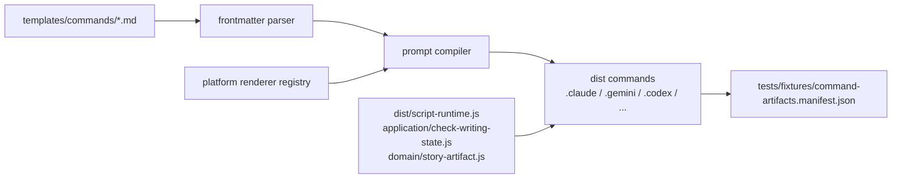
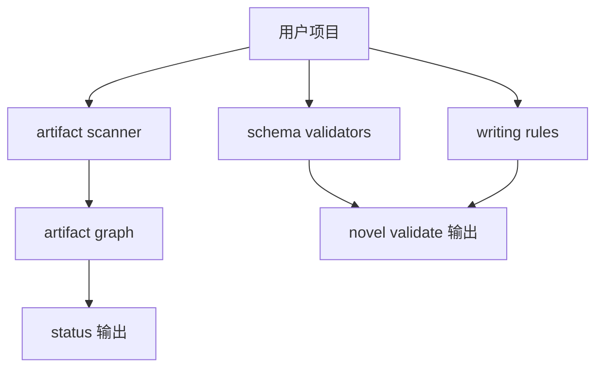
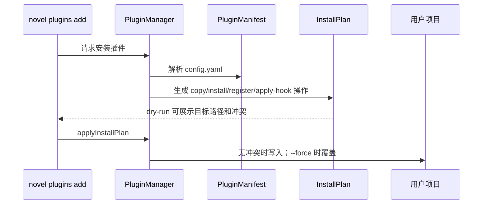

# Novel Writer 技术架构

本文档记录 Novel Writer 当前重构后的真实架构，面向后续维护者、插件作者和使用 Codex 接手项目的开发者。

Novel Writer 是一个面向中文小说创作的 SDD 工具。它把“创作宪法、故事规格、创作计划、任务清单、章节正文、追踪数据、质量校验”视为一组可验证的工程产物，并通过多 AI 平台 slash command 把这些产物组织成可执行流程。

## 架构原则

- CLI 只负责参数解析、输出渲染和依赖装配，业务流程沉到 application 层。
- domain 层定义小说项目、任务、插件声明等稳定契约，不依赖文件系统和终端实现。
- infrastructure 层封装 Node 文件系统、Git、脚本执行器等外部能力。
- prompt 与 templates 层把命令模板、平台差异和覆盖顺序集中管理，避免平台逻辑散落在 shell 脚本里。
- validation 层把“AI 应该写对”的约束变成程序可检查的 issue、severity 和 rule。
- 插件安装采用 plan/apply 两阶段，先显式展示写入文件与冲突，再执行落盘。

## 模块边界



## 源码目录

| 路径 | 职责 | 主要契约 |
| --- | --- | --- |
| `src/cli/` | Commander 程序入口和命令注册 | `runProgram`、`register*Command` |
| `src/application/` | 用例编排，不直接绑定具体 CLI | `initProject`、`upgradeProject`、`getProjectStatus`、`validateProject`、`runNovelScript` |
| `src/domain/` | 领域模型和解析器 | `StoryArtifact`、`WritingTask`、`PluginManifest` |
| `src/infrastructure/` | Node 运行时适配 | `NodeFileSystem`、`CommandGitAdapter`、`NodeScriptExecutor` |
| `src/prompt/` | prompt 编译与多平台命令生成 | `compileCommandTemplate`、`renderCommandForPlatform`、`buildCommandArtifacts` |
| `src/templates/` | 模板 resolution stack | core、extension、preset、project-local override |
| `src/plugins/` | 插件扫描、安装计划、冲突处理、hook 应用 | `planInstallPlugin`、`applyInstallPlan` |
| `src/validation/` | 项目结构、任务、追踪数据和写作规则校验 | `scanStoryArtifacts`、`buildArtifactGraph`、`ValidationIssue` |
| `src/utils/` | AI 平台 registry、项目路径和终端工具 | `AI_PLATFORMS`、`findProjectRoot` |
| `scripts/build/` | 构建期辅助脚本 | command artifact manifest、build command 入口 |

## 核心数据流

### 初始化项目



### 命令产物生成



`buildCommandArtifacts` 是命令产物的 TypeScript 单一入口。旧的 `scripts/build/generate-commands.sh` 只作为兼容包装保留。生成产物变化必须更新 manifest，并通过 `npm run check:command-manifest` 在验证链路中显式暴露。

### 状态与校验



`status` 关注“能否接手继续写”，会汇总故事进度、追踪数据、AI 平台配置、Codex prompt、`AGENTS.md` 与 blocker；`codex-status` 保留为兼容别名。`novel validate` 关注“结构和产物是否合格”，会输出 error/warning/info，并支持 `--severity` 过滤。

### 插件扩展流



插件 manifest 支持 `commands`、`templates`、`knowledge`、`trackingRules`、`experts`、`hooks`。hook 当前支持 `append`、`prepend`、`replace-marker`，用于在明确声明的扩展点修改目标文件。

## 生成项目结构

```text
my-novel/
  .specify/
    config.json
    memory/
    scripts/
      bash/
      powershell/
      runtime/
    templates/
  .codex/ | .claude/ | .gemini/ | ...
    prompts/ 或 commands/
  spec/
    tracking/
    knowledge/
  stories/
    001-story-name/
      specification.md
      creative-plan.md
      tasks.md
      content/
  plugins/
  experts/
```

核心真相源如下：

| 产物 | 作用 |
| --- | --- |
| `.specify/memory/constitution.md` | 创作原则和边界 |
| `stories/*/specification.md` | 单个故事的需求和设定 |
| `stories/*/creative-plan.md` | 章节结构、线索和节奏 |
| `stories/*/tasks.md` | 可执行写作任务、依赖和输出路径 |
| `spec/tracking/*.json` | 情节、时间线、角色状态和关系追踪 |

## 运行时脚本

旧项目和旧 prompt 仍可能调用 `.specify/scripts/bash/*.sh` 或 `.specify/scripts/powershell/*.ps1`。当前策略是保留这些路径作为 compatibility layer，并把核心扫描能力迁移到 TypeScript：

- `src/application/check-writing-state.ts` 实现写作状态扫描。
- `src/script-runtime.ts` 提供 Node runtime 入口。
- `buildCommandArtifacts` 会把 runtime bundle 复制到 `.specify/scripts/runtime/`。

这样旧命令路径继续可用，新逻辑只维护一份 TypeScript 实现。

## 验证与 CI

本地和 CI 使用同一组验证命令：

```bash
npm run build
npm test
npm run test:coverage
npm run check:command-manifest
npm run build:commands
npm run test:smoke
npm run verify
```

当前质量门槛：

- `npm test` 运行 unit tests。
- `npm run test:coverage` 使用 `@vitest/coverage-v8`，核心源码 statements/branches/functions/lines 均不低于 60%。
- `npm run check:command-manifest` 校验多平台命令生成产物 hash。
- `npm run test:smoke` 覆盖 CLI 初始化、插件冲突、upgrade dry-run 和脚本 runtime 兼容。
- GitHub Actions 在 Ubuntu/Windows 与 Node 20/22 矩阵上运行 `npm run verify`。

## 扩展点

| 扩展点 | 推荐入口 | 注意事项 |
| --- | --- | --- |
| 新 AI 平台 | `src/utils/ai-platforms.ts`、`src/prompt/platform-renderers/index.ts` | 同步更新命令产物 manifest 和 smoke/golden 断言 |
| 新命令模板 | `templates/commands/*.md` | 使用 frontmatter 声明描述、参数和脚本变体 |
| 新写作规则 | `src/validation/rules/writing-rules.ts` | 返回统一 `ValidationIssue`，明确 severity |
| 新插件能力 | `plugins/<name>/config.yaml`、`src/domain/plugin-manifest.ts` | 优先声明式 manifest，不把写入逻辑藏在命令正文；当前统一经 `plugins:add` 安装 |
| 新脚本能力 | `src/application/run-script.ts` 或新的 application 用例 | 优先 TypeScript runtime，shell/PowerShell 只做兼容入口 |
| 新模板层 | `src/templates/resolver.ts` | 保持 project-local > preset > extension > core 的覆盖顺序，并输出最终来源诊断 |

## 设计取舍

- 继续使用 Commander，而不是迁移到 oclif：当前命令数量有限，拆分命令模块即可获得足够的可测试性。
- 继续保留 shell/PowerShell 路径：用户项目已经生成过这些入口，直接删除会破坏旧 prompt；runtime 迁移先解决逻辑漂移。
- 插件安装不默认覆盖：AI agent 自动执行时，默认保护用户已有文件；需要覆盖时必须显式 `--force`。
- 产物一致性用 hash manifest，而不是提交完整 dist：仓库保持轻量，同时能发现 prompt compiler 的行为变化。
- 覆盖率先设 60%：当前目标是建立持续门槛，后续可按模块逐步提高。
